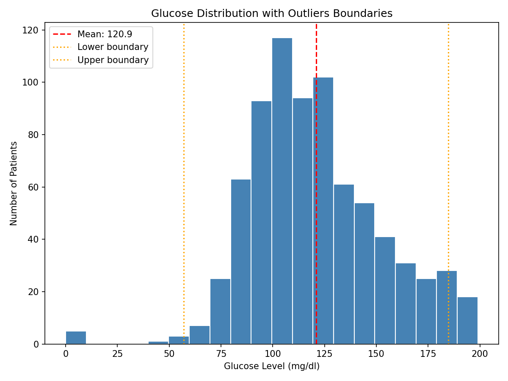

# Pharmacology Python Exercises

Python exercises and biomedical data analysis built during my 
computational biomedical research training — working toward 
graduate research in computational pharmacology and drug 
discovery.

**Author:** Divine (Benita) Esabu, PharmD Student  
**Institution:** University of Benin  
**Started:** June 2026

## Purpose

I am a PharmD student building technical skills in Python, 
statistics, and data analysis to pursue graduate research in 
computational pharmacology, with a long-term goal of contributing 
to drug discovery research relevant to African patient populations.

## Progress Log

### Phase 1 — Foundations (May–November 2026)

**Week 1 (June 2026):** Statistics foundations — mean, median, 
mode, variance, standard deviation, normal distribution, 
empirical rule, outliers, skewness, population vs sample, 
correlation.

**Week 2 (June 2026):** Python core — variables, data types, 
lists, dictionaries, conditionals, loops, and functions. 
Implemented the Cockcroft-Gault equation for estimating 
creatinine clearance.

*More to come as the project progresses.*

## Analysis Projects

### 1. Blood Glucose Statistics Analysis (June 2026)

**Dataset:** Pima Indians Diabetes Dataset (768 patients, 
9 variables)

**Methods:** Manual calculation of mean, median, standard deviation, and outlier detection (2-SD rule) using base Python, cross-checked against Pandas' built-in statistical functions. Visualised distribution using Matplotlib with mean and outlier boundary lines marked.

**Key Findings:**
- Mean glucose level: 120.9 mg/dL
- Standard deviation: 32.0 mg/dL
- The distribution is positively skewed, with a long right tail extending toward higher glucose values.
- 36 values fell outside the 2-SD boundary (57.0 to 18.8)
- Several of these outliers are 0 mg/dL readings, which are clinically impossible and almost certainly represent missing data coded as zero rather than genuine measurements 
— a data quality issue worth flagging before any further analysis

**Tools:** Python (base), Pandas, Matplotlib.

**Notebook:** [day19_mini_analysis.ipynb](day19_mini_analysis.ipynb)

